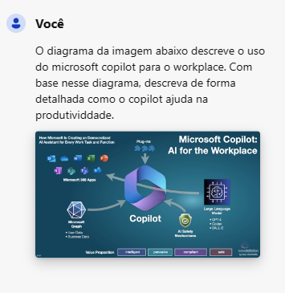
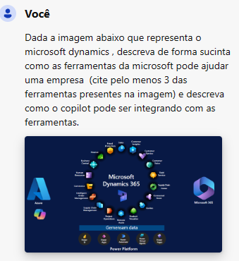

<h1>
    
     Microsoft Copilot AI

</h1>

# :computer: Desafio de projeto: 

## Explorando os Recursos de IA Generativa com Copilot e OpenAI

### Instruções de Entrega do Desafio

1. Crie um novo repositório no github com um nome a sua preferência
2. Crie uma pasta chamada 'inputs' e salve as imagens que você utilizou
3. Crie uma pasta chamado 'output' e salve os resultados de reconhecimento de texto nessas imagens
4. Crie um arquivo chamado readme.md , deixe alguns prints descreva o processo, alguns insights e possibilidades que você aprendeu durante o conteúdo.
5. Compartilhe conosco o link desse repositório através do botão 'entregar projeto'

# :bulb: Solução do desafio

* As imagens se encontram na pasta *\inputs* 

* Com os prints forneço o prompt para cada imagem

* Copiei e formatei a resposta do Copilot para markdown

## Imagem 1

O Microsoft Copilot para o Workplace é uma ferramenta poderosa que integra inteligência artificial em várias aplicações do Microsoft 365 para aumentar a produtividade. Aqui estão alguns pontos detalhados sobre como ele ajuda:

1. **Proposição de Valor**: O Copilot oferece uma proposta de valor significativa ao automatizar tarefas repetitivas e fornecer insights acionáveis, permitindo que os usuários se concentrem em atividades mais estratégicas.

2. **Inteligente**: Utilizando modelos avançados de linguagem como o GPT-4, o Copilot pode entender e executar tarefas complexas, desde a redação de documentos até a análise de dados, melhorando a eficiência e a precisão.

3. **Pervasivo**: Integrado em várias aplicações e plugins do Microsoft 365, o Copilot está sempre acessível, ajudando em diversas funções e tarefas de trabalho, desde e-mails até reuniões e gestão de projetos.

4. **Conformidade e Segurança**: O Copilot prioriza a segurança e a conformidade, utilizando mecanismos de segurança de IA para proteger dados de usuários e empresas, garantindo que as operações sejam seguras e em conformidade com as regulamentações.

Esses aspectos combinados fazem do Microsoft Copilot uma ferramenta essencial para aumentar a produtividade no ambiente de trabalho. Se precisar de mais detalhes sobre algum ponto específico, estou aqui para ajudar!

## Imagem 2

As ferramentas do Microsoft Dynamics 365 ajudam as empresas a melhorar a eficiência e a tomada de decisões. Três das ferramentas presentes na imagem são:

1. **Azure**: Oferece serviços de computação em nuvem para construir, testar, implantar e gerenciar aplicativos e serviços.

2. **Power BI**: Ferramenta de análise de negócios que permite visualizar dados e compartilhar insights em toda a organização.

3. **Sales Insights**: Fornece insights acionáveis sobre dados de vendas, ajudando a melhorar o desempenho de vendas.

O Copilot pode ser integrado com essas ferramentas para aumentar a produtividade:

* **Azure**: Automatiza tarefas como configuração de ambientes e implantação de serviços.

* **Power BI**: Auxilia na criação de modelos de dados complexos e visualizações, sugerindo otimizações.

* **Sales Insights**: Oferece sugestões de próximas ações com base na análise de dados históricos de vendas.